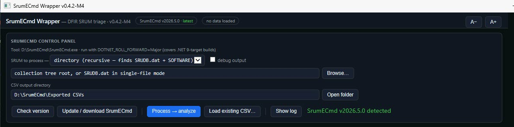
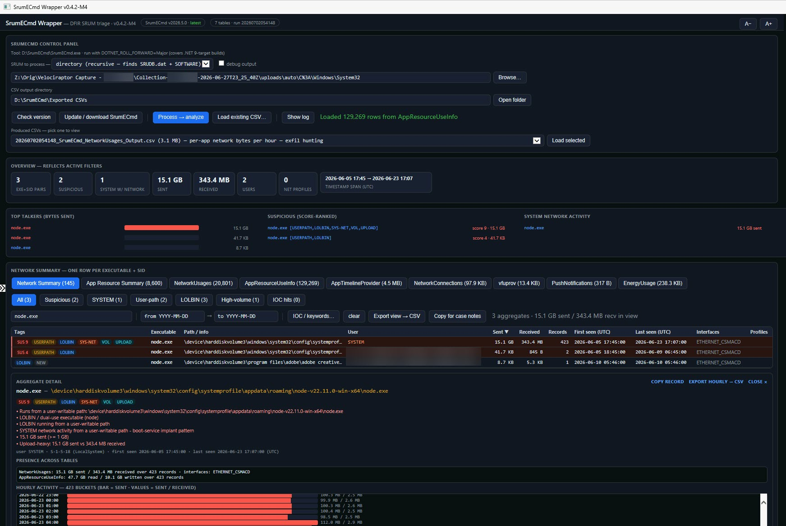

# SrumECmd Wrapper

A single-file, double-clickable GUI for triaging the **Windows System Resource Usage Monitor (SRUM)** database with [Eric Zimmerman's SrumECmd](https://ericzimmerman.github.io/) — built for DFIR casework, with **data-exfiltration hunting** as the primary use case.

No install, no dependencies, no framework: one `.hta` file that runs on any Windows box via the built-in `mshta.exe`. Point it at a collected `SRUDB.dat` (or a KAPE / Velociraptor collection tree), and it runs SrumECmd for you and turns the multi-CSV output into an interactive, suspicion-scored triage view.





## Why SRUM

SRUM is the only native Windows artifact that **quantifies per-application network volume** — bytes sent and received, bucketed roughly hourly, retained for ~30–60 days. That makes it uniquely valuable for two DFIR questions prefetch and the event logs cannot answer:

- **How much data left the box, and when?** Per-app `BytesSent` is the closest thing Windows keeps to an exfiltration meter.
- **What did a SYSTEM boot-service actually do?** Services started at boot often leave no per-executable prefetch, but their execution and network activity land in SRUM under the `systemprofile` (S-1-5-18) account — exactly where implants hide.

## Features

- **Runs SrumECmd for you** — directory mode (`-d`, recurses a collection tree and locates both `SRUDB.dat` and the `SOFTWARE` hive automatically) or single-file mode (`-f` with an optional `-r SOFTWARE` hive). Runs asynchronously in a visible console so the UI never freezes. URL-encoded collection paths (`C%3A…` from Velociraptor) are handled.
- **Self-managing tooling** — finds `SrumECmd.exe` next to the `.hta` (or in `C:\ZimmermanTools`), checks the live latest version against ericzimmerman.github.io, and can download/update a self-contained copy with one click. Sets `DOTNET_ROLL_FORWARD=Major` automatically so .NET 9-target builds run on newer runtimes.
- **Dirty-database handling** — a `SRUDB.dat` from a raw collection is frequently ESE-dirty or carries transaction logs from a newer Windows build. The wrapper recognizes the failure, offers a one-click **repair on a copy** (copies the `.dat` alone, runs `esentutl /p /o`, re-processes — original evidence untouched), and honestly reports the one case that cannot be repaired locally (a database whose *format* is newer than the analysis host's ESE engine — parse it on an equal-or-newer Windows build, or collect via Velociraptor's SRUM artifact instead).
- **One tab per SRUM table** — NetworkUsages, AppResourceUseInfo, AppTimelineProvider, NetworkConnections, vfuprov, PushNotifications, EnergyUsage (and any future table SrumECmd adds). Tables parse lazily on first open, in chunks, so a 130k-row table never white-screens the app.
- **Two per-executable summary views** (one row per executable + SID):
  - **Network Summary** — total sent / received, record count, first/last seen, interfaces, network profiles. Sorted by bytes sent: the top talkers rise to the top.
  - **App Resource Summary** — total foreground+background bytes read / written: execution evidence plus the local-disk staging that often precedes exfil.
- **Suspicion scoring** tuned for SRUM (see table below). Suspicious aggregates are shaded; raw table rows inherit their aggregate's tags; every tag explains itself on hover.
- **IOC / keyword list** — paste or load terms; matched case-insensitively against executable paths, SIDs, users, interfaces and network profile names, rescoring live (+3 per hit).
- **Filters** — category buttons with live counts (All / Suspicious / SYSTEM / User-path / LOLBIN / High-volume / IOC hits), free-text search across all columns, and a UTC date range that also re-aggregates the summary views to the window.
- **Resizable columns** — drag a column header's right edge to resize it; widths persist per view (in a small settings sidecar next to the `.hta`); double-click the edge to reset all widths.
- **Overview dashboard** — dataset stats plus Top talkers, score-ranked Suspicious, and a SYSTEM-network hotlist; all recomputed under active filters, all clickable.
- **Detail pane** — click any row for the full path, tags with reasoning, presence across every table (network sent/received, disk read/written, row counts elsewhere), and an **hourly activity mini-timeline** that makes exfil windows and beaconing cadence visible at a glance.
- **Reporting** — export any filtered view (table or summary) to CSV, export a **single process's per-hour activity** (network and disk series merged) to CSV, or copy formatted case-note lines to the clipboard.

## Quick start

1. Download `SrumECmd-Wrapper.hta` into an empty folder **on a local disk** (see the note about network drives below).
2. Double-click it. If `SrumECmd.exe` isn't found next to it, the app offers to download the latest official build.
3. Point the input at a SRUM source and click **Process → analyze**:
   - **directory mode** — a collected `…\Windows\System32` folder (so `System32\sru\SRUDB.dat` and `System32\config\SOFTWARE` are both inside the tree), or any KAPE / Velociraptor collection root;
   - **single-file mode** — a specific `SRUDB.dat`, with an optional `SOFTWARE` hive for network-profile resolution.
4. Or skip processing and **Load existing CSV…** to analyze SrumECmd CSVs you already have — loading any one CSV of a run opens every sibling table.

> The live `C:\Windows\System32\sru\SRUDB.dat` on a running machine is locked by the SRUM service and cannot be read in place — collect it first (Velociraptor / KAPE / raw copy) and process the collection.

## Suspicion heuristics

Score ≥ 2 marks an aggregate suspicious. Scoring is computed per executable + SID; raw rows inherit their aggregate's tags.

| Tag | Trigger | Score |
|---|---|---|
| `USERPATH` | Executable runs from a user-writable path (`\Users\`, `\AppData\`, `\Temp\`, `\Downloads\`, `\ProgramData\`, `\Windows\Temp\`, `$Recycle.Bin`, `\Public\`; Defender's platform dir excluded). Device-path aware (`\device\harddiskvolumeN\…`). | +2 |
| `LOLBIN` | Dual-use binary (node, java, powershell, cmd, wscript, mshta, rundll32, regsvr32, certutil, bitsadmin, curl, python, psexec, wmic, …) | +1 (+1 more if also user-path) |
| `MASQ` | OS-binary name (svchost, lsass, explorer, …) running **outside** `\Windows\` | +3 |
| `SYS-NET` | SYSTEM (S-1-5-18) **network** activity from a user-writable path — the boot-service-implant pattern (e.g. a RAT under `\windows\system32\config\systemprofile\appdata\`) | +2 |
| `VOL` | Aggregate bytes sent ≥ 100 MB (+1) or ≥ 1 GB (+2) | +1 / +2 |
| `UPLOAD` | Bytes sent ≥ 10 MB **and** sent ≥ 3× received (common sync/backup/AV agents allowlisted) | +1 |
| `IOC` | User IOC/keyword list hit anywhere in the aggregate | +3 |
| `RANDOM` | Hex-blob or entropy-smelling executable name | +1 |
| `NEW` | First seen in the last 14 days of the dataset — filter aid, no score | 0 |

## Notes & limitations

- All timestamps are displayed **as SrumECmd emits them: UTC**. No local-time conversion, on purpose.
- SRUM's `Timestamp` column is an **hourly flush bucket**, not an event time: SRUM commits from memory to the ESE database roughly hourly (and at shutdown), so an event can predate its Timestamp by up to ~1 hour, and the final unflushed hour is lost on a hard power-off.
- `ExeInfo` is not always a path — SRUM stores device paths, bare executable names, UWP package IDs, service-host blobs, and opaque tokens. Path-based heuristics apply only when the value looks like a path.
- SRUM records byte counts **per interface, per hour**; an executable spanning interfaces produces multiple rows, which the summary views total per executable+SID. Loopback/local traffic is counted.
- SRUM may be absent or sparse on servers and some SSD-policy machines. Absence of a record is not evidence of absence.
- **Network drives:** an HTA launched from a mapped drive or UNC path runs in a restricted security zone where the UTF-8 file reader (`ADODB.Stream`) is blocked. The app detects this and falls back to ANSI file IO automatically — everything works, but rare non-ASCII characters (accented usernames, some Wi-Fi profile names) may display incorrectly. For full fidelity, run the `.hta` from a local disk.
- **ESE engine version:** SrumECmd parses through the host's local ESE engine. A `SRUDB.dat` whose on-disk format is newer than the analysis host's Windows build cannot be opened locally, and `esentutl` repair fails the same way — parse it on an equal-or-newer Windows build (a VM works), or collect SRUM with an engine-independent tool. Compare `esentutl /mh SRUDB.dat` ("attached by") against the host.
- Table display caps at 6,000 rows for responsiveness; exports always write the full filtered set.

## Command line

The wrapper can be launched with arguments so an artifact-finder (or a shortcut) opens it already pointed at an artifact:

```
mshta.exe "SrumECmd-Wrapper.hta" "<inputOrCsv>" ["<outDir>"] [/auto]
```
- `<input>` — a `.csv` (auto-loaded into the viewer) or an `SRUDB.dat` file / collection directory (prefilled; processed if `/auto`).
- `<outDir>` — CSV output directory (optional; defaults to `_Processed\<host>\SrumECmd` next to the app).
- **Target hostname** is required before processing — it names the `_Processed\<host>\SrumECmd` output folder next to the app (family convention shared with the DFIR-Artifact-Finder, so processed evidence is visible per host per tool). Guessed from `Collection-<host>-…` paths, a passed `_Processed\<host>\` outDir, or this machine's name for live paths — overwrite the guess if it's wrong.
- **Shared IOC list** — an `IOC.txt` next to the app (one term per line, `#` comments) is auto-merged into the IOC box at launch; one list covers the whole toolkit and terms you paste locally are kept.
- **Run provenance + triage summary** — every successful run appends a `runinfo.json` entry (app, host, input path, files) in the output folder, including a triage summary (entries, flagged count, max score, top hits, MB sent); the DFIR-Artifact-Finder shows these per host in its inventory, even for standalone runs.
- `/auto` — process immediately.

## Credits

- [Eric Zimmerman](https://ericzimmerman.github.io/) for SrumECmd and the EZ Tools suite — this is an unaffiliated wrapper around his parser; all parsing credit is his.

## License

MIT — see [LICENSE](LICENSE).
